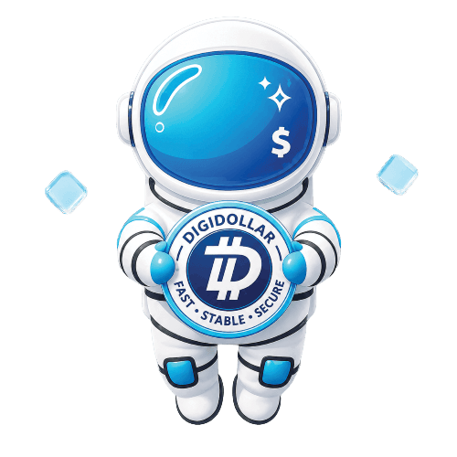
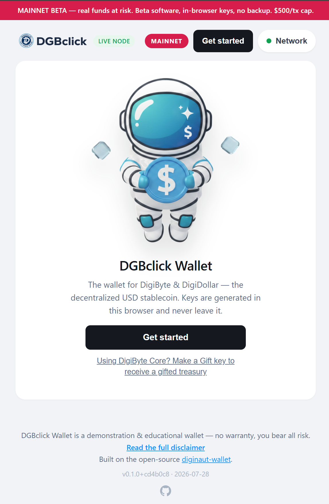
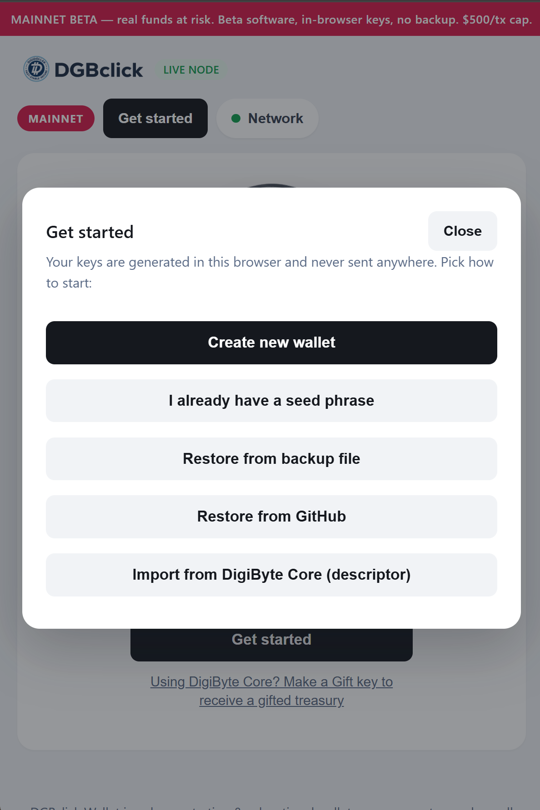
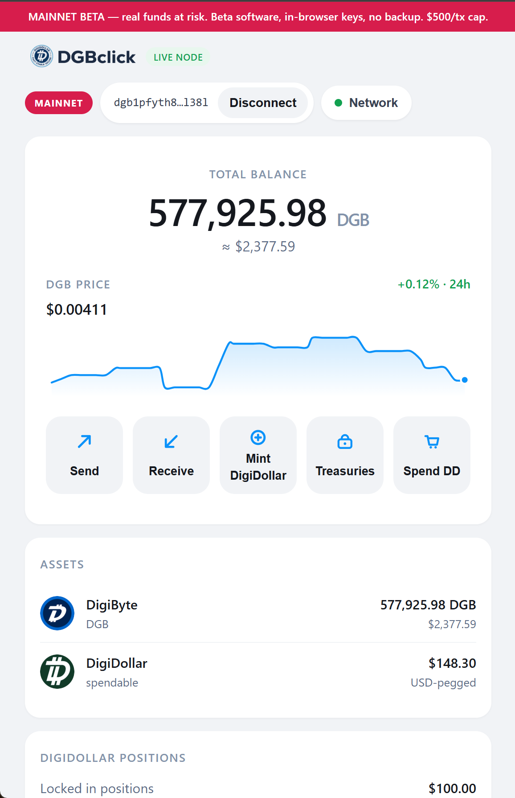

<p align="center">
  
</p>

<h1 align="center">DGBclick Wallet</h1>

<p align="center"><b>Money that answers to you — and only you.</b></p>

## In plain words

DGBclick Wallet is a website that works like a bank account **you** fully own — for digital
money. You can hold DigiByte (DGB), turn it into **DigiDollar** (a coin built to stay worth
$1), lock savings for a period you choose, gift them to someone you love, and spend them at
real merchants.

- **No signup, no app store, no permission slip.** Open the site, make a wallet in seconds.
- **Only you hold the keys.** They are created on your device and never leave it. There is
  no company behind the curtain that can touch your balance.
- **Everything on this page is the exact code the website runs.** You don't have to trust
  it — you can check it.

👉 **Just want to use it? Go to [wallet.dgbclick.com](https://wallet.dgbclick.com) —
you never need anything else on this page.** (Want to practice first with play money?
See [Try it](#try-it) below.)

<p align="center">
  
  &nbsp;
  
  &nbsp;
  
</p>

<p align="center"><i>Thirty seconds from opening the site to holding your own keys — and every<br/>
feature (Send, Receive, Mint, Treasuries, Spend DD) one tap from the balance.</i></p>

## Why this wallet exists

Money is the shape your effort takes. You trade your hours, your skill, your judgment — and
money is what you hold the value in until you choose to trade it back. That only works when
money is **yours**: earned, kept, and spent **by consent** — value for value, never by
decree.

But look at what "your" money usually is. A balance at a bank is an IOU that a stranger can
freeze. A currency is a promise that someone else dilutes, printing away the hours you
already traded. A payment app is a gatekeeper that can say no — to a purchase, to a person,
to a country. Somewhere along the way we accepted that holding money means asking
permission.

It doesn't have to.

This wallet is built on a simple conviction: **the person who earned the money is the only
person who should have a say over it.** Not a better bank — no bank. Not a nicer gatekeeper —
no gate. Just you, your keys, and arithmetic that treats everyone exactly the same, whether
they move ten dollars or ten million.

When someone tells you that your money should answer to them, they are telling you what they
plan to do with it. This wallet is the alternative: money that keeps its promises because no
one can make it break them.

## What you can do with it

### 🔑 Hold money that's actually yours

If someone else can say no, it was never yours. Your wallet is a seed phrase — twelve words
that exist only with you. No account to close, no balance to freeze, no terms of service
standing between you and what you earned. Lose the device? Your words restore everything,
anywhere on Earth, in seconds.

### ⚡ Send value without asking anyone

A father wiring money home shouldn't pay a toll to three companies and wait three days for
the privilege. Sending DGB settles in seconds, for a fraction of a cent, to any person on
the planet with a phone — on a Sunday, across a border, at 3 a.m. No business hours. No
"pending review." The network doesn't care who you are, and that's the point.

### 💵 Make your money steady — without a bank

Saving in a currency that melts is running up a down escalator. **DigiDollar** is DigiByte's
decentralized stablecoin: you mint it by locking DGB as collateral, and it's built to hold
$1 of value — not because a company promises there's a dollar in a vault somewhere, but
because the collateral and the rules are enforced by the network itself, in the open. Your
paycheck, your prices, your plans — steady. No bank account required.

### 🔒 Save with a lock *you* set

Everyone knows the person who dips into savings "just this once." Sometimes it's us.
**Treasury vaults** turn a promise into arithmetic: lock DGB for a month, a year, ten years —
and the network itself refuses to release it early. Not a penalty fee you can pay to break
your word. A door with no handle until the day you chose.

- The college fund that survives every emergency but the real one.
- The house deposit that can't become a vacation.
- The retirement money your future self will thank you for — because your present self
  couldn't touch it.

Split your savings into as many independent vaults as you like — one per goal, one per
child, one per dream — each with its own date, each minting its own steady DigiDollar.

### 🎁 Give a gift no one can take back

Ordinary gifts of money come with invisible strings: a bank that can reverse it, an app that
can claw it back, a parent who means well. A **gift key** is different — the moment it's
created, the vault belongs to the recipient, locked until the date *you* set, and not even
you can undo it. A graduation fund that opens at eighteen. A wedding gift that waits for the
first home. A head start for someone you believe in — delivered as twelve words on paper,
with no middleman in between.

### 🛍️ Spend it in the real world

Money you can't spend is a collectible. The built-in **Spend DD directory** lists merchants
who take DigiDollar directly — paid in stable value, settled in seconds, with no card
network skimming three percent off someone else's honest work. Every merchant on that list
is someone trading value for value, the way money was meant to move.

## Why you can trust it

Trust should be something you verify, not something you're asked for.

- **Your keys never leave your device.** Every transaction is built and signed in your
  browser; the servers only ever see data that's already public.
- **The code here is the code that runs.** This repository is a reviewed snapshot of exactly
  what serves [wallet.dgbclick.com](https://wallet.dgbclick.com).
- **Tested against the network itself.** Before any fund-moving code ships, its transactions
  must match DigiByte Core's byte-for-byte — proven, not promised.
- **Audited for hostile conditions** — hostile browsers, dropped connections, malicious
  infrastructure — and the findings are public in [AUDIT.md](AUDIT.md).

No signup. No custody. No permission. Just money that works the way you do.

## Try it

- **The real thing:** <https://wallet.dgbclick.com> — mainnet, real funds, real DigiDollar
  (active on DigiByte mainnet since block 23,869,440; backed by a DigiByte Core **v9.26.5**
  node).
- **Practice with play money:** <https://dgb.ludere.space> — a permanent **testnet**
  instance. Create a wallet, claim free valueless test DGB from the built-in faucet, and run
  the full mint / lock / gift / redeem cycle end-to-end.
- **The upstream author's instance:** <https://diginaut.ludere.space> — the project this
  fork builds on.
- **Run your own:** everything you need is in this repo — see
  [docs/SELF-HOSTING.md](docs/SELF-HOSTING.md). Money that answers to you can also be
  *served* by you.

> DigiDollar minting is a DigiByte softfork. On testnet it is already active; on mainnet it
> activates network-wide at the softfork block. DGBclick Wallet enables the mint flow
> automatically once the node it talks to reports DigiDollar active — the same build serves
> every network.

---

## For developers

A **non-custodial, browser-based wallet** for [DigiByte](https://digibyte.org)'s
**DigiDollar** stablecoin: create a wallet, send and receive DGB, and mint, transfer, and
redeem DigiDollar — **without running a node, and without anyone else ever holding the
keys.** This fork adds **Treasury Wallets** — split DGB into many independent, time-locked,
individually giftable vaults ([spec](docs/treasury-wallets-spec.md),
[use cases](docs/treasury-use-cases.md)) — including **trustless gifting at creation** via
Gift keys (the recipient owns the position from its first block; Core-wallet recipients are
first-class, [proven on regtest](docs/discovery/core-recipient-gift-findings.md)), a
resumable self-retrying batch engine, server-push block events, and encrypted GitHub
backup/restore.

> Built on the open-source [diginaut-wallet](https://github.com/tonymorony/diginaut-wallet) by Anton Lysakov (MIT).
>
> This public repository receives **reviewed release snapshots** — development happens in a
> private repository, and each release here is a sanitized copy of exactly what runs at
> [wallet.dgbclick.com](https://wallet.dgbclick.com). Issues and PRs are welcome against this repo.

## How it works

- **Keys live in your browser** (BIP39 seed, BIP86 taproot derivation), never on a server
  (ADR-0001). DGBclick Wallet is taproot-native.
- Consensus-critical transactions (mint / transfer / redeem) are **built and signed client-side**
  by the pure-protocol library, then broadcast through a shared read/broadcast node that never
  sees a private key.
- Before any fund-moving code ships, it must pass a **differential harness**: JS-built
  transactions byte-identical to DigiByte Core-built ones on regtest (ADR-0001, ADR-0002).
- **One build serves every network.** The banner, title, and address format are decided at
  runtime from the chain the node reports — nothing about the network is baked into the HTML.

## Monorepo layout

| Path | What it is |
|---|---|
| `packages/digidollar-js` | Pure-protocol DigiDollar library — deterministic functions, zero I/O (ADR-0004). Mirrors DigiByte Core v9.26.4 arithmetic exactly. |
| `apps/wallet` | The DGBclick Wallet web app — dashboard, mint calculator, send/receive, and an RPC allow-list proxy. First consumer of the library. |
| `apps/indexer` | Address-level query façade (ADR-0003) over a stock ElectrumX — UTXOs and history by address only; xpubs never reach it. |
| `apps/faucet` | Testnet faucet — hands out valueless testnet DGB so new users have collateral to experiment with. |
| `docs/adr/` | Architecture decisions. `CONTEXT.md` is the domain glossary; `ROADMAP.md` traces how the project got here. |

## Run

```bash
npm install   # links workspaces (only audited @noble/@scure crypto deps)
npm start     # → http://localhost:8787
npm test      # node:test across all workspaces
```

**Mock mode (default):** without RPC credentials the app serves realistic fake data shaped like
real RPC responses — usable before you have a node.

**Real node:** copy `apps/wallet/.env.example` → `.env`, set `DGB_RPC_USER` / `DGB_RPC_PASS` /
`DGB_RPC_URL` (the `rpcport` from your `digibyte.conf`), load it and `npm start`.

## Consensus lock tiers (DigiByte Core v9.26.4)

Collateral required to mint, by lock period — from `src/consensus/digidollar.h`:

| Lock period | Collateral | | Lock period | Collateral |
|---|---|---|---|---|
| 1 hour | 1000% | | 2 years | 275% |
| 30 days | 500% | | 3 years | 250% |
| 3 months | 400% | | 5 years | 225% |
| 6 months | 350% | | 7 years | 212% |
| 1 year | 300% | | 10 years | 200% |

Plus a 1% safety margin, and a Dynamic Collateral Adjustment (DCA) surcharge when system-wide
collateralization degrades. `digidollar-js` reproduces this arithmetic exactly (integer/BigInt,
ceiling division — see its tests).

## Safety posture

- The RPC proxy exposes an explicit **allow-list of read methods only**; fund-moving RPCs are not
  reachable from the browser.
- Mint is **never shipped without redeem and transfer** (ADR-0002) — no one-way traps.
- Keys are held only in the browser. **There is no server-side backup** — if you lose your device
  storage without having backed up your seed phrase, the funds are gone. Back up your seed.
- Known deferrals and their triggers live in [TODO.md](TODO.md).

## Status

All PRD stories are shipped and the wallet runs the full mint / transfer / redeem cycle. The
[roadmap](ROADMAP.md) records the path from the initial restructure (M0) through nodeless
onboarding (M1), the differential harness (M2), and the stablecoin release (M3). Work is tracked
in the repo's issue tracker; architecture decisions live in [docs/adr/](docs/adr/).

## Versioning

A deployed build identifies itself as `v<semver>+<short-sha> · <commit-date>` — in the
UI footer and machine-readably as `version` in `/api/config` (so each domain of a
dual-network deployment names the exact build it runs: `curl -s <domain>/api/config`).

- The **semver** comes from `apps/wallet/package.json` (the single source of truth) —
  bump it when behavior changes meaningfully.
- The **commit stamp** needs no manual step on the reference deploy path:
  `apps/wallet/.version-stamp` carries a git `export-subst` placeholder that
  `git archive` expands at deploy time (the prod deploy ships an archive, not a
  checkout). Running `node server.js` from a working tree asks git directly. A
  container built from a plain `git pull` checkout has neither, and honestly reports
  `v<semver>+dev` — deploy from `git archive` if you want stamped builds.
- Treat the string as opaque (it is not strict semver build metadata).

## License

[MIT](LICENSE) © Anton Lysakov and DGBclick (dgbclick.com). All packages in this monorepo are
MIT-licensed; the publishable `digidollar-js` library carries its own copy of the license.
Third-party dependencies (`@noble/*`, `@scure/*`, `qrcode-generator`) are MIT.

This software is provided for demonstration and educational purposes, **as is** and without
warranty of any kind (see the license). You are solely responsible for any funds or keys you
use with it.
